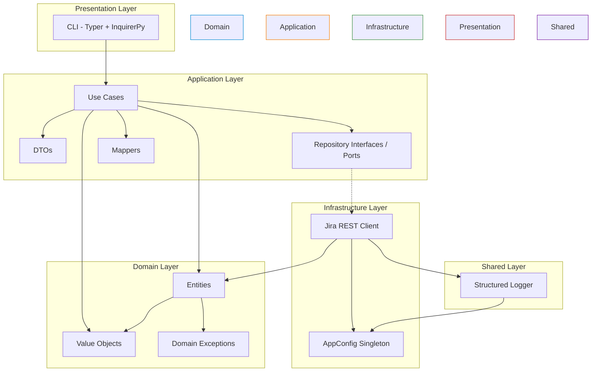
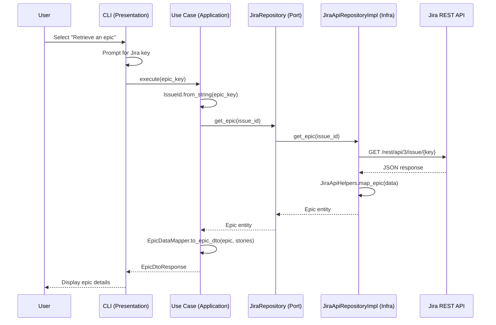

# Architecture Overview

Story Flow Engine follows **Clean Architecture** principles combined with **Domain-Driven Design** (DDD) patterns. The goal is to keep the domain logic independent of external concerns (Jira API, CLI framework, logging), making the system testable, maintainable, and adaptable to change.

## Layer Dependency



**Key rule**: Dependencies point inward. The domain layer has no dependencies on external frameworks or libraries. The application layer depends only on domain abstractions, never on infrastructure implementations.

## Request Flow



## Layer-by-Layer Breakdown

### Domain Layer (`src/app/domain/`)

The core of the application. Contains all business rules and is completely framework-agnostic.

#### Entities

Business objects with identity and behavior. Both use the **Factory Method** pattern — direct `__init__` is blocked; use `.create()`.

**`Epic`** — A large body of work that can contain multiple stories:

```python
epic = Epic.create(
    key="PROJ-123",
    numeric_id=10042,
    summary="User Authentication System",
    description="Implement OAuth2-based authentication...",
    status=IssueStatus.TODO,
    created_at=datetime.now(),
    updated_at=datetime.now(),
    priority="High",
    labels=["auth", "security"],
    story_points=21,
)
```

**`UserStory`** — A single feature from the end-user's perspective:

```python
story = UserStory.create(
    key="PROJ-124",
    numeric_id=10043,
    summary="Login with Google",
    description="As a user, I want to login using my Google account...",
    status=IssueStatus.TODO,
    created_at=datetime.now(),
    updated_at=datetime.now(),
    epic_key="PROJ-123",
    acceptance_criteria=["Given... When... Then..."],
)
```

Both enforce invariants at construction time: keys can't be empty, numeric IDs must be non-negative, summaries are required.

#### Value Objects

Immutable, self-validating objects with no identity. Equality is based on value, not reference.

| Value Object | Description | Key Behavior |
|-------------|-------------|--------------|
| `IssueId` | Jira issue key + numeric ID | Parsed from strings like `PROJ-123` |
| `Priority` | Priority level (Highest → Lowest) | Comparison: `priority.is_higher_than(other)` |
| `StoryPoints` | Estimation points | Arithmetic: `sp1 + sp2`, `sp * 3` |
| `Label` | Case-insensitive tag | Max 255 chars, non-empty validation |
| `LabelSet` | Immutable collection of labels | Set operations: `add()`, `remove()`, `contains()` |

All value objects use `@dataclass(frozen=True)` for immutability.

#### Domain Exceptions

Structured error hierarchy rooted at `DomainException`:

```
DomainException
├── EntityNotFoundException      # Epic/story not found
├── BusinessRuleViolationException  # Invalid data or state
├── DuplicateEntityException     # Duplicate issue detected
├── InvalidStatusTransitionException  # Illegal status change
└── UnauthorizedWorkspaceAccess  # Cross-project access attempt
```

### Application Layer (`src/app/application/`)

Orchestrates domain objects to fulfill use cases. Depends only on domain abstractions.

#### Use Cases

Each use case is a single-responsibility class:

```python
class GetEpicWithStories:
    def __init__(self, jira_repository: JiraRepository):
        self.jira_repository = jira_repository  # Dependency injection

    async def execute(self, epic_key: str) -> EpicDtoResponse:
        epic_id = IssueId.from_string(epic_key)
        epic = await self.jira_repository.get_epic(epic_id)
        if not epic:
            raise EntityNotFoundException("Epic", epic_key)
        stories = await self.jira_repository.get_stories_in_epic(epic.id)
        return EpicDataMapper.to_epic_dto(epic, stories)
```

#### Repository Interface (Port)

Abstract base class defining the contract for Jira operations:

```python
class JiraRepository(ABC):
    @abstractmethod
    async def get_epic(self, issue_id: IssueId) -> Optional[Epic]: ...
    @abstractmethod
    async def get_user_story(self, issue_id: IssueId) -> Optional[UserStory]: ...
    @abstractmethod
    async def get_stories_in_epic(self, epic_id: IssueId) -> List[UserStory]: ...
    @abstractmethod
    async def create_epic(self, summary: str, description: str) -> Epic: ...
    @abstractmethod
    async def create_story(self, story: UserStory) -> UserStory: ...
    @abstractmethod
    async def update_story_status(self, issue_id: IssueId, new_status: str) -> None: ...
```

This interface allows swapping the Jira implementation (e.g., mock for tests, different API client) without touching business logic.

#### DTOs and Mappers

DTOs define the data shape at boundaries. Mappers transform between domain entities and DTOs:

```
Domain Entity → EpicDataMapper.to_epic_dto() → EpicDtoResponse
```

### Infrastructure Layer (`src/app/infrastructure/`)

Concrete implementations of ports. This is where framework code lives.

#### Jira Client (`JiraApiRepositoryImpl`)

Implements `JiraRepository` using `httpx` for async HTTP calls:

```python
class JiraApiRepositoryImpl(JiraRepository):
    def __init__(self, jira_config: dict):
        self.base_url = jira_config["base_url"]
        self.email = jira_config["email"]
        self.api_token = jira_config["api_token"]

    async def get_epic(self, issue_id: IssueId) -> Optional[Epic]:
        url = f"{self.base_url}/rest/api/3/issue/{issue_id.key}"
        async with httpx.AsyncClient() as client:
            response = await client.get(url, auth=(self.email, self.api_token))
        response.raise_for_status()
        return JiraApiHelpers.map_epic(response.json())
```

The `JiraApiHelpers` class handles API response mapping — converting raw JSON into domain entities via the factory methods.

#### Configuration (`AppConfig`)

Thread-safe singleton that:
1. Loads `.env` variables via `python-dotenv`
2. Reads `APP_ENV` to select a YAML config file
3. Provides `get_config("jira.timeout")` with dot-notation access
4. Uses exponential backoff retry for config loading

### Presentation Layer (`src/app/presentation/`)

The CLI built with **Typer** and **InquirerPy**:

```python
app = typer.Typer(no_args_is_help=False)

def interactive_menu():
    menu_choice = inquirer.select(
        message="Select an option:",
        choices=[...]
    ).execute()
    if menu_choice == "get_epic":
        fetch_epic(jira_key)
    elif menu_choice == "create_epic":
        create_epic(file_path)
```

The presentation layer creates a `JiraApiRepositoryImpl` via the `get_jira_repository()` dependency function and passes it to use cases.

### Shared Layer (`src/app/shared/`)

Cross-cutting utilities used across layers, independent of business logic.

#### Logging (`src/app/shared/logging.py`)

Centralized structured logging with request-correlation context. Emits single-line JSON by default (dev/prod) or human-readable plain text for local/container runs, selected via the `format_type` key in the environment YAML config (`text` or `json`). Correlation IDs (`request_id`, `user_id`) are injected into every record via context variables. Callers obtain a logger with `get_logger(__name__)`; `AppConfig` calls `initialize_logging()` at startup.

#### Utilities (`src/app/shared/utils/`)

Reusable helpers: `retry_decorator` (exponential backoff for transient failures). Used by config loading and repository operations.

## Dependency Injection

Currently manual (no DI framework). The `dependencies.py` factory creates the concrete repository:

```python
def get_jira_repository() -> JiraApiRepositoryImpl:
    config = AppConfig.instance()
    jira_config = config.get_config("jira")
    return JiraApiRepositoryImpl(jira_config)
```

Use cases receive the repository through constructor injection.

## DDD Patterns in Use

| Pattern | Where | Why |
|---------|-------|-----|
| **Factory Method** | `Epic.create()`, `UserStory.create()` | Ensures all invariants are checked before the object exists |
| **Value Object** | `IssueId`, `Priority`, `StoryPoints`, `Label` | Immutable, self-validating, equality by value |
| **Repository (Port)** | `JiraRepository` ABC | Decouples domain from infrastructure |
| **Entity** | `Epic`, `UserStory` | Objects with identity and lifecycle |
| **Domain Exception** | `EntityNotFoundException`, etc. | Business-meaningful errors, not generic exceptions |
| **DTO** | `EpicDtoResponse`, `StoryDtoResponse` | Clean boundary between layers |
| **Mapper** | `EpicDataMapper` | Transforms between layers without leaking concerns |

## Testing Architecture

Tests mirror the source structure:

```
tests/
├── unit/
│   ├── domain/
│   │   ├── entities/       # Epic, UserStory factory method tests
│   │   ├── value_objects/  # Priority, IssueId, Label, StoryPoints tests
│   │   └── exceptions/     # Exception hierarchy tests
│   └── application/
│       └── use_cases/      # GetEpicWithStories tests with mocked repos
└── integration/
    └── test_jira_repository.py  # JiraApiRepositoryImpl with respx mocking
```

The application layer is tested with mocked `JiraRepository` implementations. The infrastructure layer uses `respx` to mock HTTP responses.
